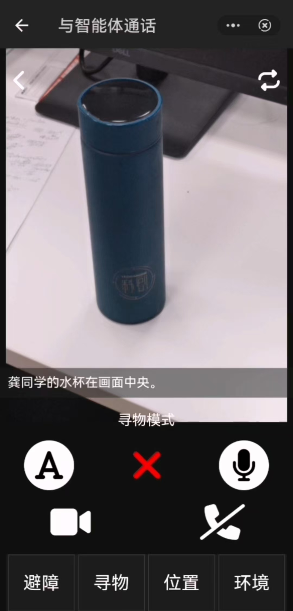
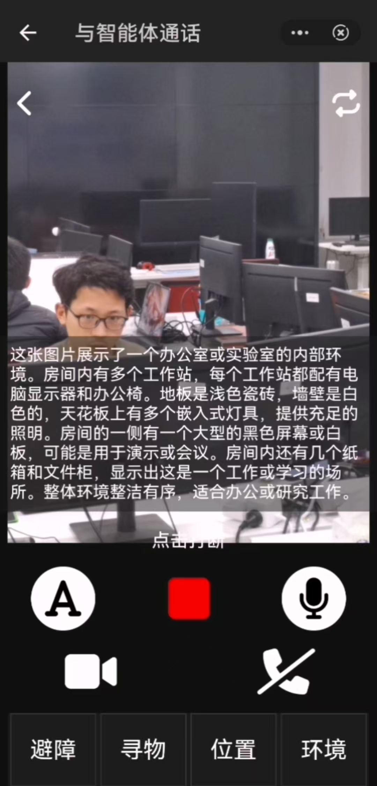
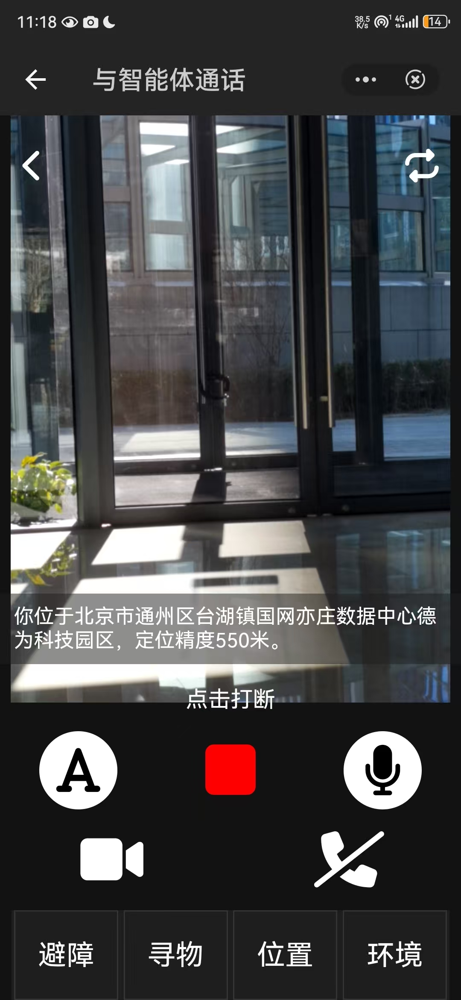
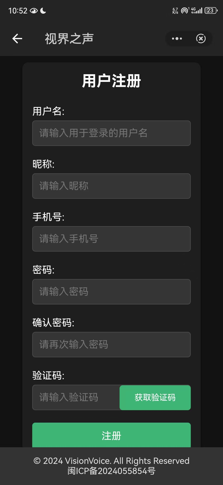
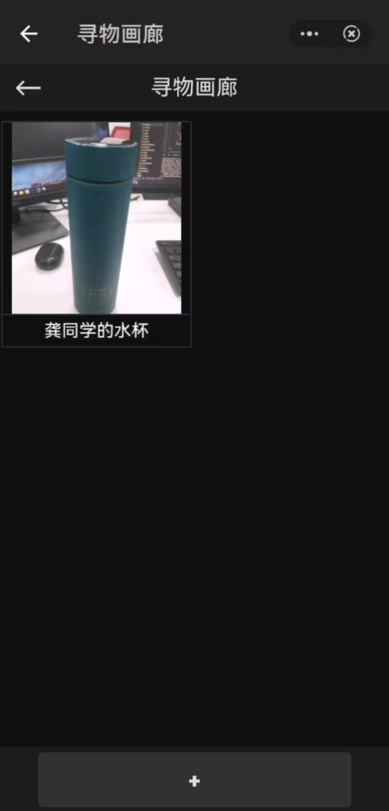
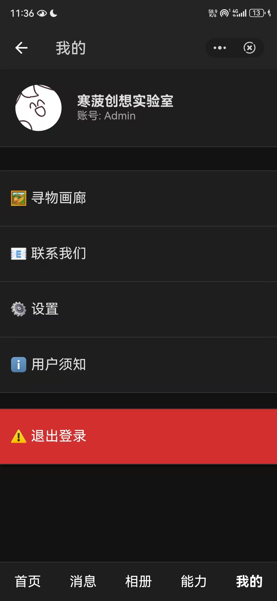
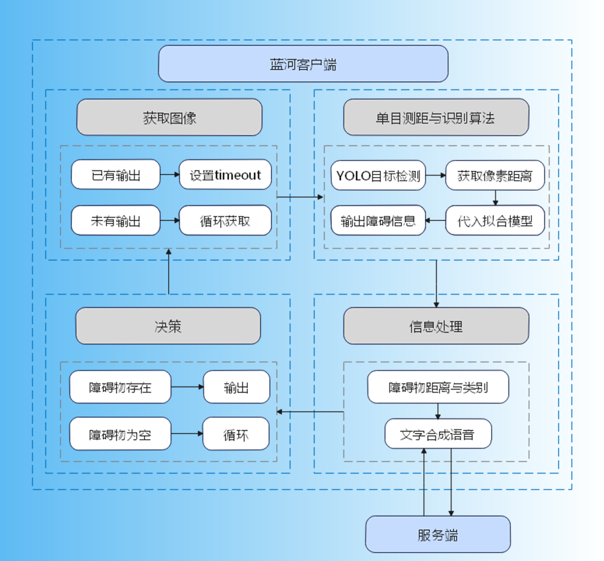
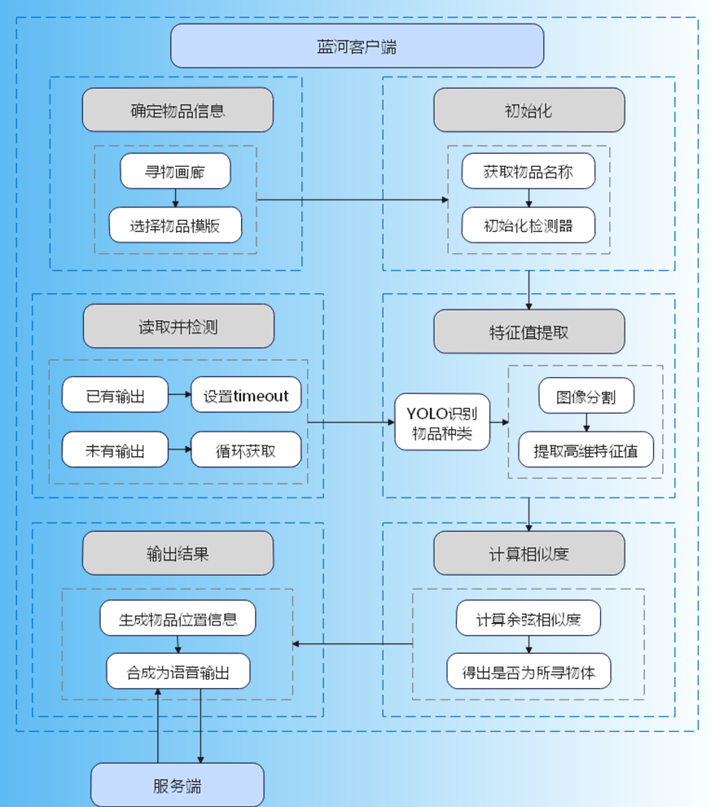
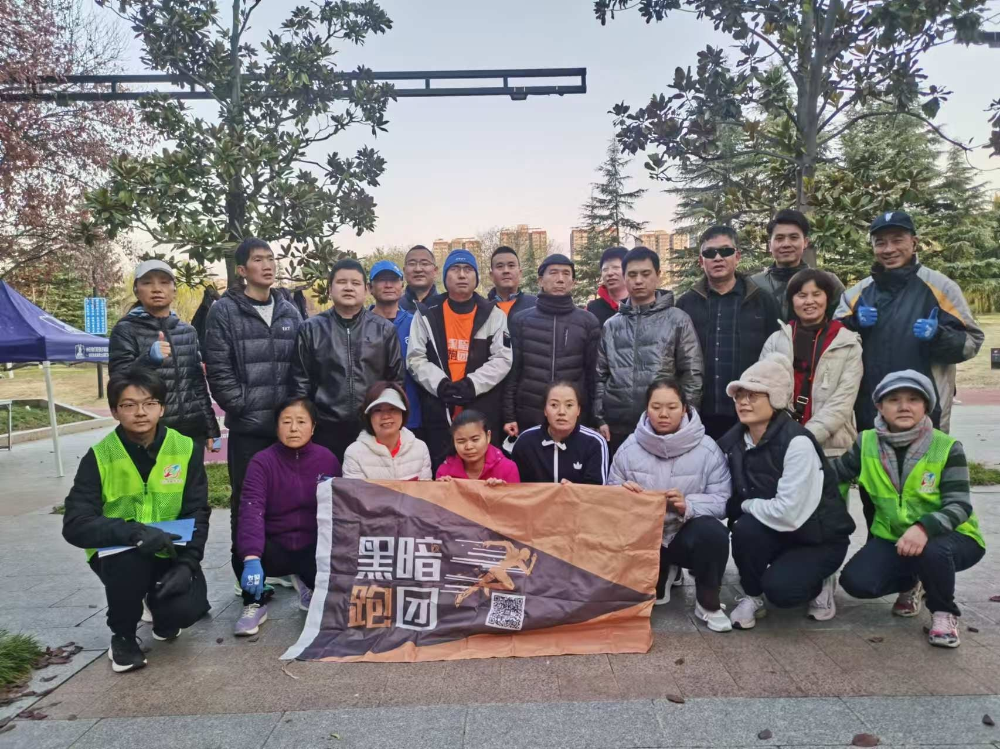

[](https://visionvoice.life/)

<div align="center">

<a href="https://visionvoice.life/html.child/%E4%BA%A7%E5%93%81%E6%BC%94%E7%A4%BA.html">🔥视界之声 在线版</a> · <a href="https://visionvoice.life/html.child/user_manual.html">📃 用户文档</a> · <a href="https://github.com/PineappleSnowy/VisionVoice/issues">报告问题</a> · <a href="https://github.com/PineappleSnowy/VisionVoice/issues">建议反馈</a> · <a href="https://visionvoice.life/html.child/%E6%9B%B4%E6%96%B0%E6%97%A5%E5%BF%97.html">更新日志</a> · <a href="https://visionvoice.life">🌐 官方网站</a>


<br>

👋 关于我们的[信息](https://visionvoice.life/html.child/%E5%85%B3%E4%BA%8E%E6%88%91%E4%BB%AC.html)

# 视界之声 VisionVoice

</div>

## 目录

- [📝 摘要](#-摘要)
- [📜 开放源码许可证](#-开放源码许可证) 
- [ℹ️ 软件基本信息](#-软件基本信息)
- [🚗 作品概述](#-作品概述)
- [🎥 演示视频与软件使用说明书](#-演示视频与软件使用说明书)
- [📋 功能描述与在线演示](#-功能描述与在线演示)
- [🚀 快速开始](#-快速开始)
- [🛠️ 视界之声开发说明](#-视界之声开发说明)
- [🌟 产品创新点](#-产品创新点)
- [🆚 视界之声与其它助盲产品的比较](#-视界之声与其它助盲产品的比较)
- [👥 关于我们](#-关于我们)

<br/>

## 📝 摘要

### 什么是“视界之声”VisionVoice？

“视界之声"(又名 VisionVoice)是一款为视障人士群体（以下简称为“用户”）开发的无障碍智能助手，分为 Windows 端体验版和 Android 端正式版。通过图像识别、单目测距、人脸检测、语音识别和语音播报等高新技术，“视界之声”可以帮助用户进行日常生活中的拍照、出行和寻物，帮助用户出行时绕开障碍物，还可以和用户进行聊天互动、专业知识问答和情感交流。

### VisionVoice README 徽章

如果你喜欢在工作中使用 “视界之声”，请将 视界之声 徽章添加到你的 README 中：

[](https://github.com/PineappleSnowy/VisionVoice)

```
[](https://github.com/PineappleSnowy/VisionVoice)
```
## 📜 开放源码许可证

本项目采用以下开放源码许可证发布：
- [Apache 2.0 License](https://github.com/PineappleSnowy/VisionVoice/tree/main/LICENSE) 

## ℹ️ 软件基本信息

- **作品标题**：视界之声 VisionVoice
- **版本**：1.0.0
- **软件分类**：多模态智能交互应用
- **作者/团队**：西安电子科技大学 PineappleSnowy 团队（又名"寒菠创想"团队）
- **联系方式**：hdgong2766@qq.com

## 🚗 作品概述

### 软件背景及应用领域

#### 软件背景

视障人士群体由于失去了视力，在生活中有诸多不便，有许多视障人士也因自身残疾而自闭自卑。为了帮助视障人士群体提高他们的生活质量， PineappleSnowy 团队 开发了无障碍智能助手“视界之声”（又名 VisionVoice），并希望这款产品能帮助他们寻找照亮他们黑暗生活的一道光。

#### 应用领域

- 帮助视障人士进行日常生活中的拍照、出行、定位、识别环境并绕开障碍物
- 在视障人士在遇到困惑的问题时为其答疑解惑，也在视障人士心情不佳时充当“心灵树洞”为其排忧解难。

> \[!IMPORTANT]
>
> **收藏项目**，你将无延迟地接收所有发布通知～ ⭐️


<br>

## 💻 演示视频与软件使用说明书

### 演示视频

可以在这里查看“视界之声”的使用 [演示视频](videos/产品主要功能演示.mp4)。也可以在这里查看手机无障碍功能中的[读屏功能演示](videos/手机盲人模式兼容演示.mp4)

[演示视频在线播放链接](https://github.com/user-attachments/assets/d16b3817-3bae-4576-9115-ed4c9166b2ec)

### 软件使用说明书

我们为用户编写了详细的用户手册和使用说明！前往 <a href="https://visionvoice.life/html.child/user_manual.html">📃 用户文档</a> 和 [软件使用说明书](assets/images/manual.pdf) 查看用户文档和软件使用说明书。

## 📃 功能描述与在线演示

[点此体验“视界之声”](https://pineapplesnowy.cn) 🚀

### 核心功能

作为面向视障人士群体的智能助手，“视界之声”由 **生活助手** 和 **心灵树洞** 组成。每个智能助手都可以和用户进行文字、语音、视频交流。并且，用户可以借助手机的无障碍读屏功能通过点击“视界之声”每个功能对应的按钮启动相应功能，或直接和智能助手进行语音或视频交流，直接说出用户当前想要做的事，“视界之声”将自动匹配与用户描述需求最接近的功能，并启动该功能服务用户。

用户可以在“视界之声”的消息列表中找到所有智能助手：

<div align=center>

</div>

用户可以直接通过语音或视频的方式和智能体进行交流对话。

当用户说话时，智能体助手将倾听用户的需求。此时“视界之声”的界面如下：

<div align=center>

</div>

在用户说完话后，智能体助手将自动启用与用户需求最接近的功能，并根据具体功能的需要通过语音向用户发送信息。此时“视界之声”的界面如下：

<div align=center>

</div>

用户随时可以通过点击界面下方的红色正方形打断智能体助手的输出。

下面将介绍每个智能体助手分别包含的具体功能。每个助手的功能如下：

- **生活助手**：

  - **避障模式**：分析周围环境，通过单目测距算法解算距离类别信息，帮助用户避开障碍物（需要开启摄像头权限）
  - **寻物模式**：通过手机摄像头寻找物品（需要用户提前拍下并保存该物品的照片，拍照时背景应尽可能干净整洁以凸显目标物品）（需要开启摄像头权限和存储权限）
  - **环境识别**：实时得到环境的细节描述（需要开启摄像头权限）
  - **帮我定位**：通过手机定位功能确定用户当前所处的具体位置（需要开启定位权限）

- **心灵树洞**：

  - **情感陪护**：可以和用户进行聊天互动和情感交流
  - **专业问答**：可以和用户进行专业知识问答

### 在线演示

来看看 视界之声 各个功能的在线演示：

#### 生活助手

|                                                            [避障模式](https://pineapplesnowy.cn/phone)                                                             |                                                           [寻物模式](https://pineapplesnowy.cn/phone)                                                            |
| :----------------------------------------------------------------------------------------------------------------------------------------------------------------: | :--------------------------------------------------------------------------------------------------------------------------------------------------------------: |
|                              <a href="https://pineapplesnowy.cn/phone">  </a>                               |                              <a href="https://pineapplesnowy.cn/phone">  </a>                               |
| “避障模式”开启时，生活助手将通过手机后置摄像头不断获取周围环境的信息，并实时通过语音向用户提醒其附近的障碍物以及障碍物与用户的间距，依此帮助用户前行时绕开障碍物。 | 当用户找不到自己的个人物品时，用户可以使用“寻物模式”功能，通过手机后置摄像头的实时录像，找到用户事先已经在手机中保存好的照片所对应的物品（照片在“寻物画廊”中）。 |

|                                [环境识别](https://pineapplesnowy.cn/phone)                                 |                               [帮我定位](https://pineapplesnowy.cn/phone)                               |
| :--------------------------------------------------------------------------------------------------------: | :-----------------------------------------------------------------------------------------------------: |
| <a href="https://pineapplesnowy.cn/phone">  </a> | <a href="https://pineapplesnowy.cn/phone">  </a> |
|            “环境识别”将通过用户的手机后置摄像头进行拍照，通过照片中的信息来分析用户周围的环境。            |                      “帮我定位”将通过用户的手机定位帮助用户确定自己当前所在位置。                       |

#### 心灵树洞

|                               [情感陪护](https://pineapplesnowy.cn/agent)                               |                                [专业问答](https://pineapplesnowy.cn/agent)                                 |
| :-----------------------------------------------------------------------------------------------------: | :--------------------------------------------------------------------------------------------------------: |
| <a href="https://pineapplesnowy.cn/agent">  </a> | <a href="https://pineapplesnowy.cn/agent">  </a> |
|                                用户可以和智能体进行聊天互动与情感交流。                                 |                                     用户可以和智能体进行专业知识问答。                                     |

<br>

## 🏁 快速开始

以下操作如果对用户来说不太方便，用户可以通过用户的家人、朋友来协助用户进行操作。

### 1.安装“视界之声”

“视界之声”现已推出电脑体验版和手机正式版。

#### 手机正式版安装

手机正式版（即“视界之声”手机版）拥有 [功能描述与在线演示](#-功能描述与在线演示) 中展示的所有功能。使用手机版“视界之声”需要用户免费注册账号并登录。

扫描二维码，免费安装“视界之声”手机版。

<div align=center>

</div>

#### 电脑体验版安装

电脑体验版只有“智慧拍照”和“环境识别”功能可以体验，目前仍处于 0.3.0 版本（其中使用说明书为“用户手册”0.3.0 版本）。电脑体验版无需注册账号。

免费[安装“视界之声”电脑体验版](https://visionvoice.life/%E5%BA%94%E7%94%A8/Camera.exe)

点击以上链接安装电脑体验版“视界之声”之后，用户需要打开 VisionVoice_3.0_Setup.exe 文件并通过提示将“视界之声”电脑体验版下载到用户喜欢的地址中。下载完成后“视界之声”会自动在桌面创建快捷方式，用户可以通过直接打开该快捷方式使用电脑体验版产品，或者找到“VisionVoice”文件夹并通过打开 openCamera.exe（如下图）文件使用电脑体验版产品。

电脑体验版“VisionVoice”文件夹:

<div align=center>

</div>

电脑体验版启动界面:

<div align=center>

</div>

电脑体验版使用界面：

<div align=center>

</div>

### 2.免费注册并登录“视界之声”

安装完成后，点击以下红色方框内的图标即可启动“视界之声”手机版。

<div align=center>

</div>

启动界面如下：

<div align=center>

</div>

启动后，在登录界面输入用户名和密码即可登录：

<div align=center>

</div>

如果用户还没有注册账号，可以点击登录界面下方的“点击注册”进入注册界面，在注册界面输入用户名、昵称和密码，点击“注册”即可成功注册：

<div align=center>

</div>

也可以在这里免费[注册账号](https://pineapplesnowy.cn/)。成功注册账号后，用户将自动登录。

<br>

### 3.使用“视界之声”的所有功能

登录后，默认直接和生活助手对话。

<div align=center>

</div>

用户可以在界面下方的聊天框输入文字和智能体交流，也可以点击界面下方的“电话”符号按钮开始和智能助手进行语音和视频通话，此时智能助手将倾听用户的发言：

<div align=center>

</div>

如果用户想要正常使用生活助手中“环境识别”“帮我定位”“寻物模式”“避障模式”等功能，请点击界面左下角的“视频”按钮打开手机摄像头，并把用户的需求通过语音告诉智能助手：

<div align=center>

</div>

用户可以通过点击界面右上角的转换箭头转换手机前置或后置摄像模式。

<div align=center>

</div>

用户还可以通过点击界面下方中央的栏目按钮展开功能栏:

<div align=center>

</div>

功能栏中的四个按钮从左至右依次为 **“避障模式”“寻物模式”“环境识别”“帮我定位”** 这四个功能，点击按钮即可快速启动对应功能：

<div align=center>

</div>

下面将详细讲解“视界之声”的所有功能。

#### 生活助手

生活助手拥有“避障模式”、“寻物模式”、“环境识别”、“帮我定位”等功能，以下是功能介绍和使用示例。

##### 避障模式

用户告诉助手“帮我躲避障碍物”等需求，智能助手将自动开启“避障模式”功能：

<div align=center>

</div>

用户随时可以通过点击界面下方的红色叉号退出“避障模式”。

用户也可以点击以下红色方框中的按钮快速开启“避障模式”：

<div align=center>

</div>

##### 寻物模式

用户需要在保存照片时对物品命名，且拍照时背景应尽可能干净整洁以凸显目标物品。照片保存在“寻物画廊”中，用户可以在“寻物画廊”中增加、删除、查看并修改照片及物品命名：

<div align=center>

</div>

用户告诉助手“帮我寻找物品”等需求，智能助手将自动开启“寻物模式”功能。此时，“视界之声”将弹出“寻物画廊”展示该用户所有拍照并命名的物品，用户在手机无障碍功能的帮助下点击本次需要寻找的目标物品对应的照片：

<div align=center>

</div>

之后，“寻物模式”将通过手机摄像头寻找目标物品，并在检测到目标物品后向用户语音播报物品位置，直到物品处于镜头正中央和用户附近：

<div align=center>

</div>

用户随时可以通过点击界面下方的红色叉号退出“寻物模式”。

用户也可以点击以下红色方框中的按钮快速开启“寻物模式”：

<div align=center>

</div>

##### 环境识别

用户告诉助手“我附近都有什么？”“我周围都是什么？”“请描述四周环境”等需求，智能助手将自动开启“环境识别”功能：

<div align=center>

</div>

下面是识别结果展示（实际使用时，生活助手将通过语音向用户播报识别结果）

<div align=center>

</div>

用户也可以点击以下红色方框中的按钮快速开启“环境识别”：

<div align=center>

</div>

##### 帮我定位

用户告诉助手“我在哪里？”“我的位置是什么？”“请描述我现在所处的位置”等需求，智能助手将自动开启“帮我定位”功能：

<div align=center>

</div>

下面是定位结果展示（实际使用时，生活助手将通过语音向用户播报识别结果）

<div align=center>

</div>

用户也可以点击以下红色方框中的按钮快速开启“帮我定位”：

<div align=center>

</div>


#### 心灵树洞

用户可以点击界面下方的“消息”进入智能体助手菜单，然后选择自己想要的智能助手（“视界之声”现在上架了两个智能助手：**生活助手**和**心灵树洞**），点击对应的智能助手即可和它交流。直接点击智能助手的头像将进入对话界面；点击电话或视频按钮将进入语音和视频通话界面。


<div align=center>

</div>

点击“心灵树洞”进入如下对话界面：

<div align=center>

</div>

用户可以通过在界面下方聊天框输入文字的信息和“心灵树洞”进行交谈，也可以点击界面左下角的“电话”按钮和智能助手进行语音和视频通话。

当智能助手倾听用户发言时：
<div align=center>

</div>

当智能助手回答用户时：
<div align=center>

</div>

用户随时可以通过点击界面下方的红色正方形打断智能助手的回答。

“心灵树洞”中的功能使用示例如下：

##### 情感陪护

用户可以和“心灵树洞”进行情感方面的问题交流：

<div align=center>

</div>

当智能助手输出时，点击该界面右下角的正方形即可打断。

##### 专业问答

用户可以和“心灵树洞”进行专业问题交流：

<div align=center>

</div>

当智能助手输出时，点击该界面右下角的正方形即可打断。

### 4.退出“视界之声”

#### 退出Android端正式版

当以上功能使用完毕后，用户可以选择继续使用对应功能，或直接在手机后台关闭应用程序即可退出登录并退出程序。用户也可以点击界面右下角的“我的”进入个人信息界面，然后点击“退出登录“即可退出登录并自动返回登录界面。

<div align=center>

</div>

#### 退出Windows端体验版

当以上功能使用完毕后，本产品将提醒用户“您可以说“退出”以退出程序，或继续选择服务：1.智慧拍照；2.环境识别”。用户可以根据提示通过说“智慧拍照”或“环境识别”的方式或通过点击左侧对应按钮继续选择使用对应功能。用户可以通过说“退出”的方式退出本产品，或通过直接关闭程序的方式退出本产品。


## 🛠️ 视界之声开发说明

### 体系结构和关键技术点

- **架构图**

  - 语音视频对话架构图：

  

  - 辅助避障架构图：

  

  - 帮我寻物架构图：
  
  

- **目录结构**

  ```sh
  .
  ├── backend # 服务端
  │   ├── .cache                  # 缓存文件目录
  │   ├── agent_files             # AI 业务逻辑处理文件
  │   ├── configs                 # 配置文件目录
  │   │   └── audio_settings.json # 语音配置文件
  │   ├── lib                     # 自定义工具库
  │   │   └── logging.py          # 日志工具
  │   ├── static                  # 静态资源文件
  │   │   ├── css
  │   │   ├── js
  │   │   └── images
  │   ├── templates               # html 模板文件
  │   ├── test                    # 测试用例目录
  │   │   ├── test_ai.py
  │   │   └── test_image.py
  │   ├── user_images             # 用户图片存储
  │   ├── .gitignore              # Git 忽略文件
  │   ├── gunicorn_config.py      # Gunicorn 配置
  │   ├── README.md               # 后端说明文档
  │   ├── requirements.txt        # 依赖包列表
  │   ├── run_forever.sh          # 持续运行脚本
  │   └── run.py                  # 主程序入口
  └── frontend                    # 客户端
      ├── VisionVoiceProject      # 蓝河手机端项目
      │   ├── README.md
      │   ├── package.json
      │   ├── .quickapp.preview.json
      │   ├── .prettierignore
      │   ├── .gitignore
      │   └── src
      │       ├── assets
      │       ├── helpers
      │       ├── IntroCard
      │       ├── app.ux
      │       ├── sitemap.json
      │       ├── manifest.json
      │       └── pages
      │           └── Home
      │               └── index.ux # 主页面：主要使用 webView 实现蓝河快应用移动端适配
      └── README.md
  ```

- **技术栈**

  - 前端：蓝河系统手机应用
  - 后台：Python 的 Flask 框架

- **关键技术点**：

  - 蓝河应用调用服务端接口识别图片
  - 服务端使用 Python 调用 AI 能力返回给客户端

## 如何运行

如果您想在本地开发和测试，以下是操作指南：

### 环境依赖

- Python 3.10 及以上

### 安装步骤

1. [第一步] 安装服务端依赖

   ```bash
   # VisionVoice/backend
   pip install -r requirements.txt
   ```

2. [第二步] 安装客户端依赖

   ```bash
   # VisionVoice/front-end/VisionVoiceProject
   pnpm install 或 npm install
   ```

3. [第三步] 配置 API

   在 VisionVoice/backend/static 目录下，参考 api_template.json 文件的格式填写 api 信息，并重命名为 api.json。

4. [第四步] 运行服务端

   ```bash
   # VisionVoice/backend
   python3 run.py
   ```

5. [第五步] 访问本地 80 端口查看网页运行结果

   ```bash
   # 访问本地80端口
   http://localhost:80
   ```

### 运行程序

由于快应用的特殊性，如果您想要在蓝河快应用环境中运行本项目:
- 快应用只能访问已部署的线上服务器(https://pineapplesnowy.cn)
- 无法直接访问本地开发服务器
- 请确保使用线上正式环境的API配置

## 更新日志

在这里，您可以查看我们对“视界之声”的开发历史。 [更新日志](https://visionvoice.life/html.child/%E6%9B%B4%E6%96%B0%E6%97%A5%E5%BF%97.child/%E4%BB%8E%E9%9B%B6%E5%88%B0%E4%B8%80.html)

## 🌟 产品创新点

- **Web开发**

  - 调用视觉能力时动态设置图片上传帧率，加速环境感知并保证响应质量
  - 图片上传与语音识别并行处理、发起大模型响应阻塞处理，实现快速响应并避免网络时延带来的逻
    辑错乱
  - 自定义音频流式合成类，自动断句、异步处理、高速响应
  - 前端适应环境噪声，自动判断用户话语起止
  - 实现用户变量和文件的独立，可应对多用户并发访问
  - 利用网络延时实现不同大模型任务语音响应独立，实现打断大模型说话的能力
  - 设计了寻物画廊图片管理系统，支持增删改查，并利用模态窗口层级防止误操作
  - 合理利用浏览器缓存，实现不同页面间的前端数据共享
  - 服务端用户数据加密存储
  - 完全兼容手机读屏模式，多方面支持语音输入，便于盲人使用

- **视觉识别、单目测距与图像处理**

  - 使用 YOLO 模型 检测图像中的目标，使用多线程并发机制同时识别多个物体并返回边界框
  - 图像分割, 排除边界框中背景的影响, 使之后的图像特征提取和特征点匹配更精确
  - ResNet50 提取图像特征 (预先将传入的图像设为固定尺寸)，去除全连接层, 从多个不同旋转角度获得高维特征向量，用于之后图像内容相似度计算
  - 计算两个图像特征向量之间的余弦相似度, 评估目标物品图像和检测物体之间的相似性，过滤掉不相似的物体
  - 对尺寸较小的物体区域，通过双三次插值放大图像，增强细节；去除噪声; 增强图像的对比度，提升细节，尤其是在低光照条件下，改善物体检测效果
  - ORB 特征点匹配, 结合计算机视觉传统技术，通过检测并匹配关键点来提高检测准确度

## 🆚 视界之声与其它助盲产品的比较

### 视界之声 vs Google 盲人眼镜

- **💰 价格低廉**：
  "视界之声"主要利用常见手机辅助用户生活并指导，无需用户单独购买硬件。而 Google 盲人眼镜 虽然功能齐全却售价一千多欧元（约合人民币一万余元），价格高昂，大部分家庭负担不起。

### 视界之声 vs Be My Eyes

- **🤖 无需志愿者**：
  Be My Eyes 需要视障人士与能够提供视觉帮助的志愿者进行实时视频通话连接，并请求志愿者的帮助。"视界之声"无需志愿者，一切功能都基于各种人工智能算法。

- **📱 支持 Anroid 使用**：
  Be My Eyes 仅适用于 iPad 和 iPhone，Android 手机用户无法使用。"视界之声"是一款快应用，可以在 Android 手机上自由使用。

- **🌏 支持国内使用**：
  Be My Eyes 是一款国外软件，国内难以使用。"视界之声"是一款自主研发的国产软件，可以在国内自由使用。

### 视界之声 vs Lookout

- **🔍 可以寻找物品**：
  视界之声 支持对一切事先由用户拍过照片的常见物品的寻找（拍照时背景需干净整洁以突出待寻物体），而 Lookout 只能识别物体。

- **💬 可以和用户进行交流沟通**：
  "视界之声"拥有"智能体"功能，用户可以和智能体进行知识问答对话，也可以和智能体进行情感交流。Lookout 没有该功能。

- **🌏 支持国内使用**：
  Lookout 是一款由 Google 开发的国外软件，国内难以使用。"视界之声"是一款自主研发的国产软件，可以在国内自由使用。

### 视界之声 vs 盲人语音寻物应答器

- **☁️ 支持在线使用**：
  通过 视界之声 可以方便地调用在远程服务器上训练的大型模型寻物并寻路。

- **📱 无需分机**：
  "视界之声"主要利用常见手机的硬件结合图像处理技术进行寻物，无需用户单独购买硬件。而 盲人语音寻物应答器 需要用户提前将分机粘贴在待寻物品，并通过语音告诉主机用户需要寻找的目标。分机数量有限，且并不能满足用户可能需要临时寻找非常用物品的需求。

### 视界之声 vs 无源贴片测距寻物系统

- **🤖 无需机器人、价格低廉**：
  视界之声 找到待寻物品后，结合避障算法并通过语音提示用户前往物品处并绕开障碍物，无需用户额外付费购买机器人。而 无源贴片测距寻物系统 仍需要用户将无源 RFID 贴片提前贴在待寻物品上，并且在找到物品后通过一个价格高昂的机器人前往物品处，寻找到合适路径后再提示用户沿此路径前进。

### 视界之声 vs RFID 射频识别盲人寻物器

- **📸 可以寻找不含电子标签的物品**：
  视界之声支持对一切事先由用户拍过照片的常见物品的寻找（拍照时背景需干净整洁以突出待寻物体），而 RFID 射频识别盲人寻物器只能识别配备电子标签的智能产品。

<br>

## 👥 关于我们

### 下载 Icon

[VisionVoice-Icon-SVG](assets/images/VisionVoice_logo.svg)

<div align=center>

</div>

<br>

### 项目贡献者

<a href="https://github.com/PineappleSnowy/VisionVoice/graphs/contributors">
  
</a>

<br>

### 我们的故事

本产品开发团队（简称为“我们”）是来自 西安电子科技大学 的 PineappleSnowy 团队，是一个全部由 00 后大学生组成的充满爱心、活力满满的团队！
为了开发出更符合视障人士需求的产品，我们联系了陕西省盲人协会并参与了“黑暗跑团”西安站的志愿活动，成为帮助视障人士跑步运动的盲人助跑员等志愿者，并在帮助盲人跑步时和盲人进行深入交流，实地调研视障人士群体的真实需求，并以此改进我们的产品。
下列图片为我们 PineappleSnowy 团队参与志愿活动的实地照片：
<div style="display: flex; justify-content:  space-around; align-items: center; gap: 20px;">
  
  
</div>

<br>

<div style="display: flex; justify-content:  space-around; align-items: center; gap: 20px;">
  
  
</div>

<br>

<div style="display: flex; justify-content:  space-around; gap: 20px;">
  
  
</div>

<br>

下图为视障人士正在现场体验我们的产品：

<div align=center>

</div>

“视界之声”之所以这样命名，是为了让我们的软件以智能手机为基础，成为盲人的眼睛，让他们去无障碍地看到感受“视界”。盲人可以在“视界之声”的帮助下与世界对话，去体会到这个世界更精彩的一面。
如果您想给您的目的地确定一条大致路径；如果您迷路了，不知道去哪里寻求帮助；如果您想感受回忆，让一个人通过您拍过的图片讲述您过去的生活……请稍微期待一下，我们会一步一步带您找到您所希望的一切。

#### _希望不再有于黑暗中踽踽独行者，每个人都拥有拥抱光彩世界的自由_

_——这是 PineappleSnowy 团队的初心_

如果您愿意和我们合作，请联系：**hdgong2766@qq.com**

### 致谢

感谢所有为本项目做出贡献的人们！

感谢您对本产品的支持！我们与您同在！

版权声明 © [2024] [PineappleSnowy]. 根据上述许可证条款授权。
