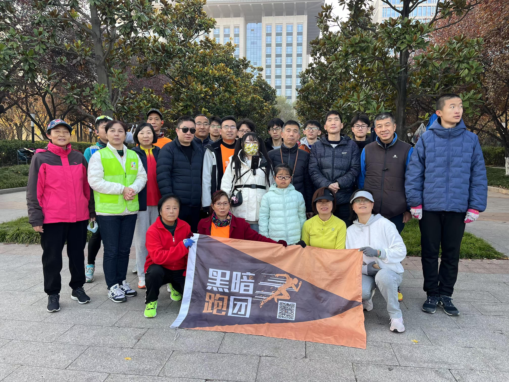
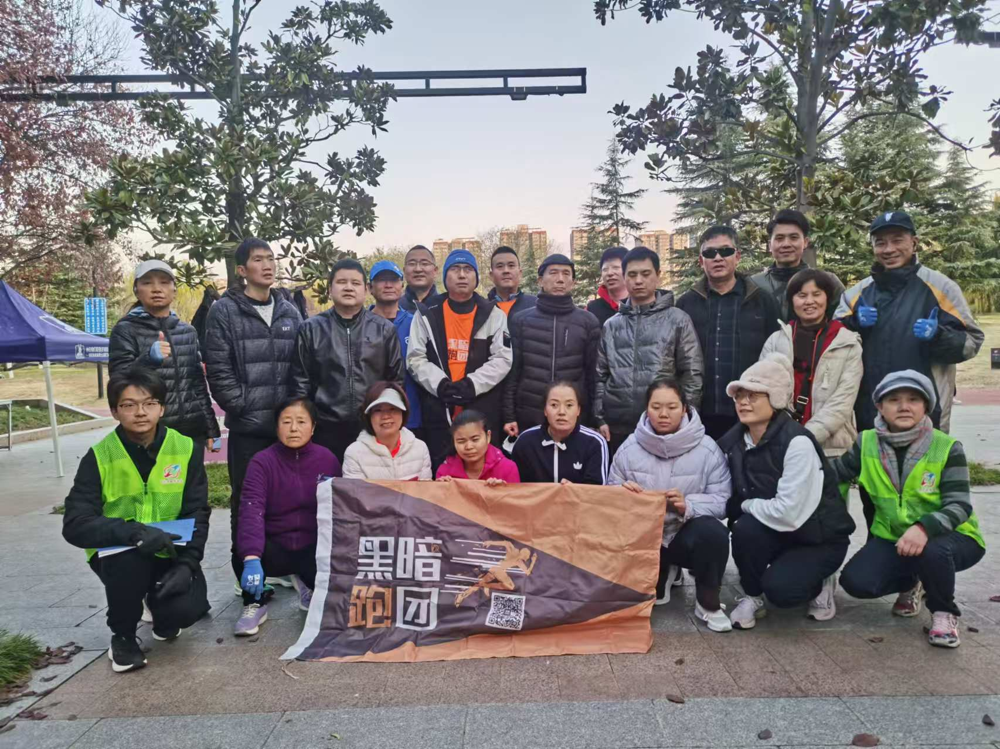
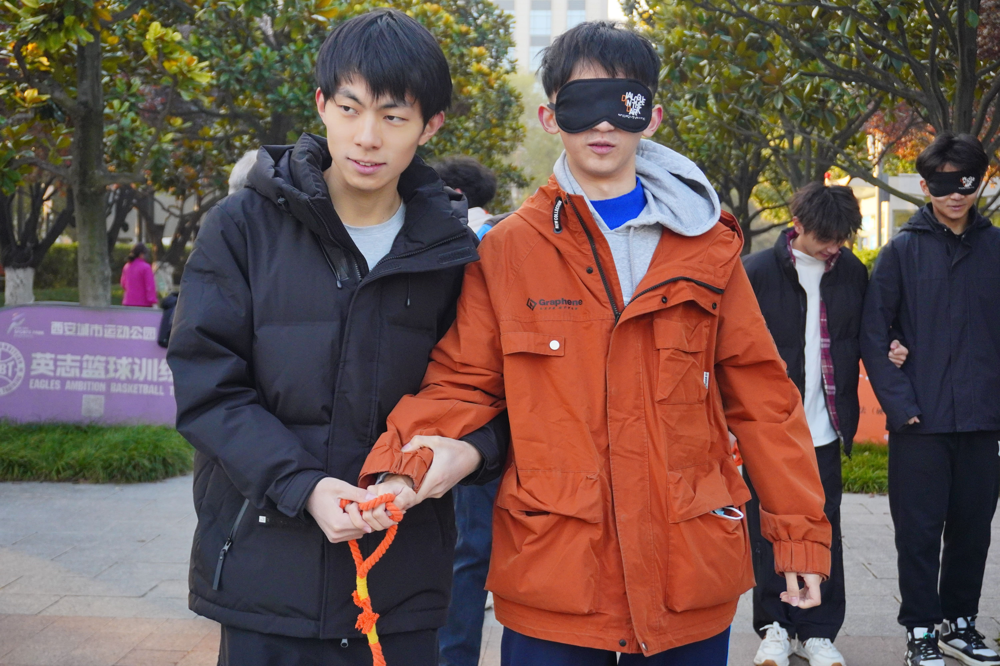
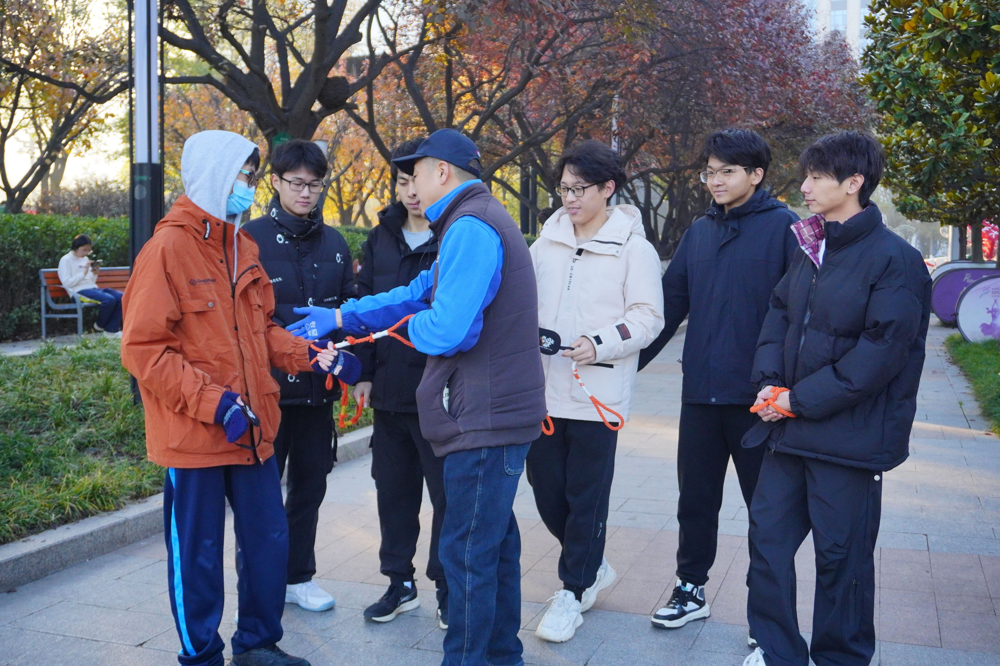
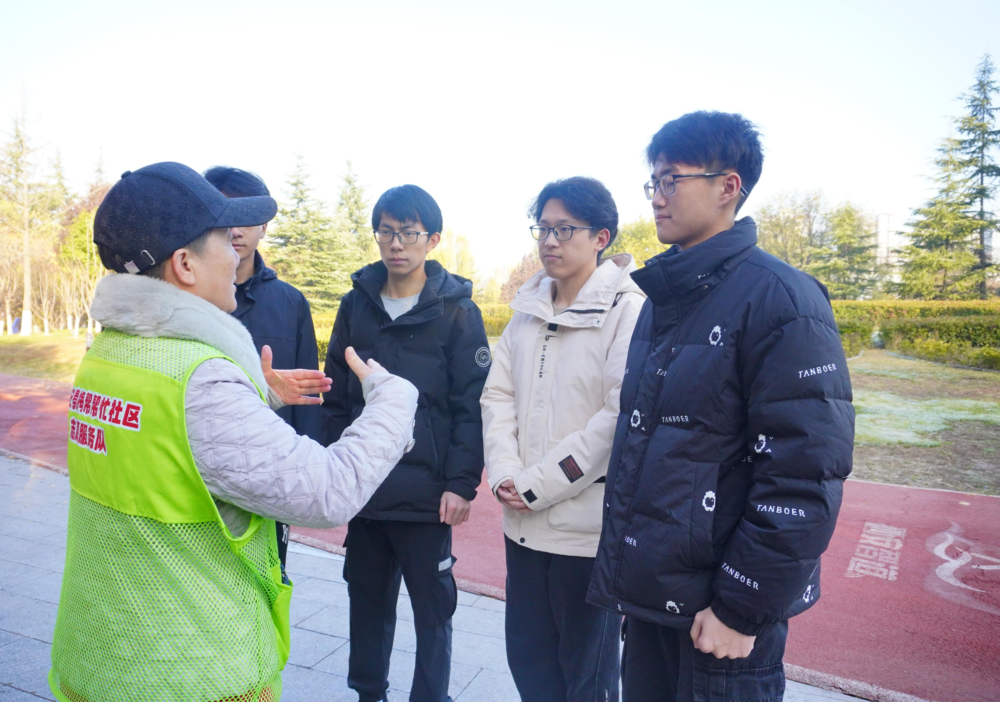
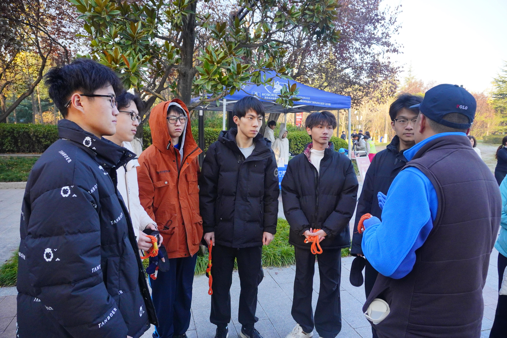
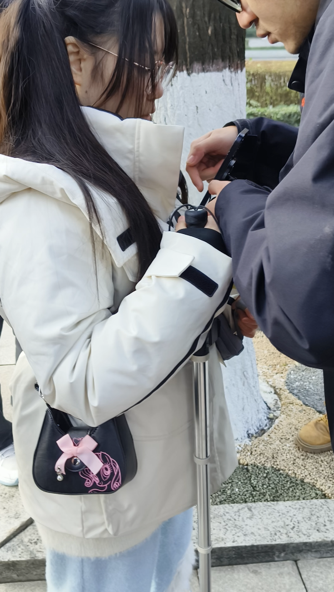

# “视界之声”智慧盲人助手项目计划书
## 一、项目概述
### 1.1 项目背景
视障人士因视力缺失，在日常出行、寻物、环境感知等方面面临诸多不便，部分群体还因自身残疾产生自闭、自卑的心理状态。现有助盲产品存在明显痛点：Google盲人眼镜等硬件产品价格高昂，普通家庭难以负担；Be My Eyes、Lookout等国外产品依赖志愿者、仅支持iOS系统或国内无法使用；RFID射频识别寻物器、无源贴片测距系统等需额外硬件支持，功能也相对单一。

针对上述问题，西安电子科技大学视界之声团队聚焦视障人士真实需求，依托成熟的人工智能与移动开发技术，研发面向安卓操作系统的“视界之声”智慧盲人助手。

### 1.2 项目目的
开发一款基于安卓操作系统的无障碍智能助手（同步推出安卓APP和快应用双端形态），通过图像识别、单目测距、语音交互等技术，解决视障人士日常拍照解读、出行避障、物品寻找、环境识别、位置定位等生活难题；同时提供情感陪护、专业知识问答等交互功能，提升视障人士生活质量，帮助其摆脱心理困境，更好地融入社会。

### 1.3 产品创新点
#### （1）前后端开发创新
- 调用视觉能力时动态设置图片上传帧率，兼顾环境感知效率与响应质量；
- 图片上传与语音识别并行处理、大模型响应阻塞处理，避免网络时延导致的逻辑错乱；
- 自定义音频流式合成类，支持自动断句、异步处理，实现高速语音响应；
- 前端适配环境噪声，自动判断用户话语起止，提升交互流畅度；
- 实现用户变量与文件独立存储，支持多用户并发访问；
- 利用网络延时实现不同大模型任务语音响应独立，支持打断大模型语音输出；
- 设计寻物画廊图片管理系统，支持增删改查，通过模态窗口层级防止误操作；
- 合理利用浏览器缓存，实现跨页面前端数据共享；
- 服务端用户数据加密存储，保障信息安全；
- 完全兼容手机读屏模式，多维度支持语音输入，适配视障人士使用习惯。

#### （2）视觉识别与图像处理创新
- 基于YOLO模型检测图像目标，结合多线程并发机制识别多物体并返回边界框；
- 目标检测快速筛选ROI（感兴趣区域），缩小特征匹配搜索空间；
- 采用MobileNet提取图像特征（固定图像尺寸、去除全连接层），从多旋转角度获取高维特征向量，用于图像相似度计算；
- 计算余弦相似度评估目标物品与检测物体的相似性，精准过滤非匹配物体；
- 对小尺寸物体区域进行双三次插值放大、去噪、对比度增强，提升低光照等复杂场景下的检测效果；
- 根据物品距离动态调整检测阈值，提高寻物、避障功能的精度。

#### （3）产品适配与体验创新
- 基于安卓操作系统开发，同时提供安卓APP和快应用双端形态，兼容主流安卓手机，降低用户使用门槛；
- 无需额外硬件（如盲人眼镜、RFID贴片、机器人）或外部志愿者支持，依托手机原生硬件+AI算法实现全功能自主运行；
- 本土化适配优化，完全支持国内使用场景，解决国外同类产品在国内无法使用的问题。

## 二、技术方案
### 2.1 总体架构
“视界之声”采用前后端分离架构，前端覆盖安卓APP和快应用双端，后端基于Python Flask框架提供核心能力支撑，核心业务架构如下：

#### 语音视频对话架构

#### 辅助避障架构

#### 帮我寻物架构

### 2.2 功能概述
“视界之声”核心功能由生活助手、心灵树洞、有声相册三大模块组成，全功能兼容安卓系统读屏模式，支持语音、视频、文字多模态交互：

#### （1）生活助手
生活助手是核心功能性模块，覆盖视障人士日常出行、寻物、环境感知等核心需求，具体包括：
- **避障模式**：通过手机摄像头+单目测距算法分析周围环境，实时语音提醒用户附近障碍物及间距，帮助绕障出行；

- **寻物模式**：基于用户预先拍摄存储的物品照片（背景需整洁以凸显目标），通过摄像头实时识别目标物品并语音播报位置；

- **环境识别**：通过摄像头拍照分析，语音描述用户周边环境的细节信息；

- **帮我定位**：调用手机定位功能，语音告知用户当前具体位置。

#### （2）心灵树洞
聚焦视障人士情感与知识需求，提供双向交互能力：
- **情感陪护**：与用户进行聊天互动、情感交流，充当“心灵树洞”缓解心理压力；

- **专业问答**：解答用户各类专业知识问题，满足信息获取需求。

#### （3）有声相册
支持图片导入与智能解析，适配视障人士的“可视化”需求：
- 支持从摄像头/手机相册导入图片，自动解析图片内容；
- 点击图片可语音播报解析结果，支持暂停/继续播报、全屏查看文字解析；
- 支持用户与产品交互，获取图片的深度分析结果，同时支持图片增删管理。

### 2.3 关键技术
- 前端技术：基于安卓操作系统完成安卓APP和快应用双端开发，核心实现多模态交互适配、读屏模式兼容、前端数据缓存与共享等能力；
- 后端技术：基于Python Flask框架搭建服务端，实现接口封装、用户数据加密存储、多用户并发处理等；
- AI算法技术：单目视觉避障算法、基于YOLO+MobileNet的寻物算法、语音识别/语音播报技术、图像特征提取与余弦相似度计算技术；
- 交互技术：音频流式合成、多任务并行处理、用户话语起止智能判断、语音响应打断机制等。

## 三、可行性分析
### 3.1 技术可行性
- 核心技术（YOLO目标检测、MobileNet特征提取、单目测距、语音交互等）均为成熟的开源技术体系，团队可基于现有技术栈快速落地；
- 安卓APP与快应用双端开发技术体系成熟，兼容主流安卓手机硬件，无需依赖特殊硬件支持；
- 后端基于Python Flask轻量化框架，部署与维护成本低，可支撑多用户并发访问；
- 团队已完成核心算法验证与原型开发，联合视障人士实地体验后反馈良好，技术落地无重大障碍。

### 3.2 需求可行性
- 视障人士日常出行、寻物、情感陪伴等需求真实且未被充分满足，现有同类产品存在价格高、适配性差、功能单一等痛点；
- 团队通过陕西省盲人协会、“黑暗跑团”西安站志愿活动实地调研，验证了产品功能与视障人士真实需求的匹配度；
- 产品本土化适配（支持国内使用、安卓系统），解决了国外同类产品的使用限制，市场需求明确。

### 3.3 经济可行性
- 开发成本：核心开发团队为高校学生团队，人力成本低；技术栈以开源框架为主，无高额授权费用；
- 使用成本：产品基于普通安卓手机运行，无需用户额外购买硬件（如盲人眼镜、RFID贴片、机器人等），降低用户使用门槛；
- 推广成本：可依托残联、盲人协会等公益渠道推广，降低市场推广成本，同时具备公益属性，易获得政策/社会资源支持。

## 四、排期规划
| 阶段         | 周期 | 核心任务                                                                 |
|--------------|------|--------------------------------------------------------------------------|
| 需求与原型优化 | 2周  | 结合视障人士实地体验反馈优化功能需求，完善产品原型，确认双端交互逻辑       |
| 技术开发阶段   | 8周  | 完成后端核心接口开发、安卓APP与快应用双端开发、核心算法集成与调优         |
| 测试与迭代阶段 | 4周  | 联合视障人士开展功能测试，修复BUG，优化算法精度与交互体验，适配不同安卓机型 |
| 试点推广阶段   | 4周  | 依托残联/盲人协会开展试点推广，收集使用反馈，完成产品最终迭代             |
| 正式发布阶段   | 2周  | 完成产品正式发布，搭建用户反馈渠道，持续提供技术支持                     |

## 五、团队与愿景
### 项目团队
本产品由西安电子科技大学视界之声团队开发，团队全部由00后大学生组成，通过参与“黑暗跑团”西安站志愿活动、对接陕西省盲人协会，深入了解视障人士真实需求并持续优化产品。

  
  

  
  

  
  

下图为视障人士正在现场体验本产品：

### 核心愿景
“希望不再有于黑暗中踽踽独行者，每个人都拥有拥抱光彩世界的自由”。
