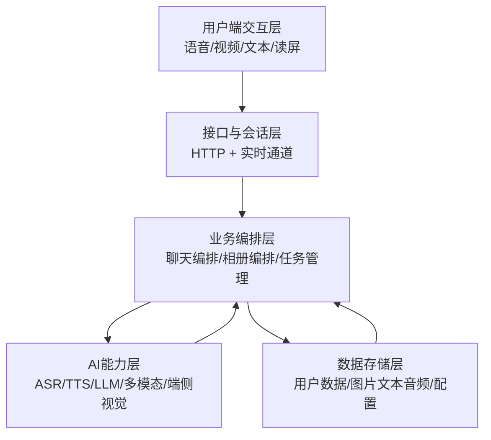
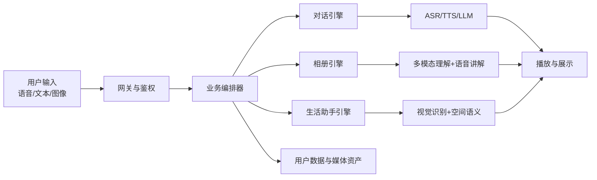
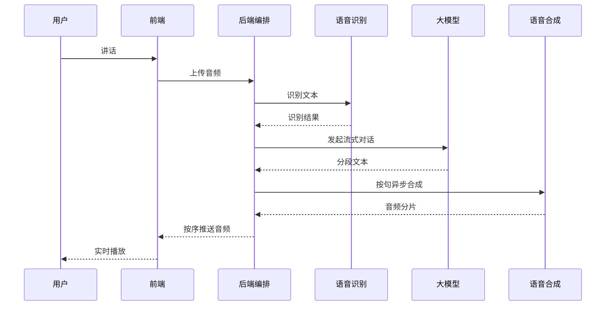
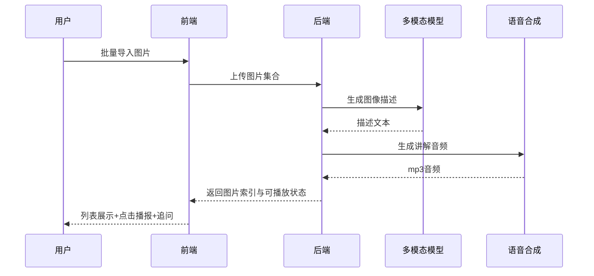
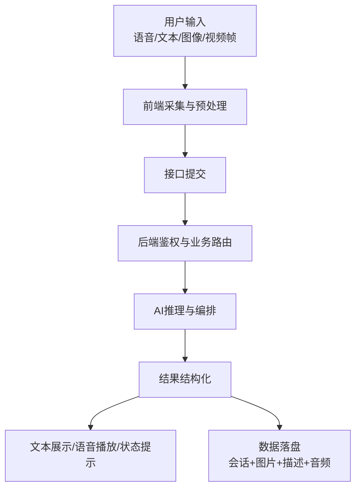

# 视界之声（VisionVoice）开发文档

## 0. 文档说明

- 文档目标：面向评审与开发协作，给出应用结构、开发环境、界面原型、核心高层设计、共享数据样例及数据流说明。
- 文档依据：项目计划书、技术研究报告、设计及创新性分析报告，以及现有后端与静态交互实现。
- 版本日期：2026年3月16日。

---

## 1. 新应用结构及开发环境设计

### 1.1 新应用结构设计

VisionVoice 采用端云协同、语音优先的多模块应用结构。应用由四个核心域组成：

1. 用户交互域
   - 语音主交互（实时听说、可打断）
   - 图像交互（相机拍摄、相册导入、多图问答）
   - 无障碍交互（读屏适配、字幕开关、麦克风开关）

2. 业务编排域
   - 身份与会话管理（注册登录、令牌校验、用户状态隔离）
   - 智能体编排（生活助手、心理陪护、专业问答）
   - 相册内容编排（图像描述、语音生成、追问对话）

3. AI能力域
   - 语音识别与语音合成
   - 文本大模型与多模态大模型
   - 端侧视觉识别（避障、寻物、特征相似度匹配）

4. 数据与资产域
   - 用户数据与会话历史
   - 用户图片、文本描述、语音讲解资产
   - 配置数据（语音参数、第三方服务配置模板、用户公告）

### 1.2 架构分层（开发视角）



### 1.3 开发环境设计

#### 软件环境

1. 运行平台
   - 操作系统：Windows（开发调试）/ Linux（部署运行）
   - Python：推荐 3.11.4
   - 浏览器：支持 WebSocket、MediaDevices、IndexedDB 的现代浏览器

2. 后端核心依赖
   - Web 框架：Flask、Flask-SocketIO、Flask-CORS
   - 认证能力：flask-jwt-extended
   - AI 服务接入：zhipuai
   - 视觉与数值：ultralytics、opencv-python、tensorflow、numpy、scikit-learn
   - 音频处理：samplerate
   - 短信能力：阿里云短信 SDK

3. 前端运行能力
   - 实时语音输入输出与播放队列
   - 端侧视觉模型推理与本地缓存（IndexedDB）
   - 摄像头切换、字幕显示、无障碍语音流程控制

#### 硬件环境

1. 用户侧硬件
   - 安卓手机（必需）
   - 摄像头、麦克风、扬声器（内置即可）
   - 可选耳机（提升噪声环境使用体验）

2. 服务侧硬件
   - CPU 服务器即可完成后端编排与第三方模型调用
   - 内存建议 8GB 及以上（并发会话更稳定）
   - 存储需支持用户图片、音频与文本资产持续增长

3. 网络条件
   - 语音流式与多模态问答对上行带宽和时延较敏感
   - 建议在稳定网络下运行实时交互能力

---

## 2. 作品主要功能的用户界面初始设计图或截屏（UI Prototype）

以下原型图来自项目计划书，可直接用于开发文档与评审材料：

### 2.1 整体能力架构示意


### 2.2 核心功能界面原型

1. 生活助手


2. 心灵树洞


3. 有声相册


---

## 3. 作品使用的软件和硬件（简要说明）

### 3.1 软件栈清单

1. 应用层框架
   - Flask：承载页面路由与业务接口
   - Flask-SocketIO：承载实时语音分片推送

2. AI 服务与算法
   - 大模型服务：文本问答、多模态图像理解、情感对话
   - 语音服务：语音识别与语音合成
   - 视觉服务：目标检测与特征匹配（端云协同）

3. 数据与安全
   - JWT 令牌会话认证
   - 文件系统与 JSON 存储（用户、相册、配置）
   - 本地模型缓存（减少重复加载时间）

### 3.2 硬件栈清单

1. 终端硬件
   - 安卓智能手机（摄像头、麦克风、扬声器）

2. 服务硬件
   - 通用服务器主机（CPU、内存、磁盘）
   - 网络设备与公网访问环境

3. 外围设备（可选）
   - 耳机、移动电源、支架

---

## 4. 主要功能高层设计（High Level Design Document）

### 4.1 HLD 总览



### 4.2 核心模块职责

1. 会话与鉴权模块
   - 注册登录、短信验证码登录、令牌校验
   - 会话上下文初始化与用户状态隔离

2. 对话流模块
   - 流式文本输出
   - 自动断句与异步语音合成
   - 音频分片按序播放
   - 任务号驱动的打断隔离

3. 相册模块
   - 批量导入图片
   - 自动生成图片描述文本
   - 自动生成语音讲解文件
   - 支持按图追问并持续多轮对话

4. 生活助手模块
   - 避障：输出方向 + 障碍类别 + 距离
   - 寻物：目标类别过滤 + 特征相似度匹配
   - 环境识别/定位：语义化播报

5. 前端展示模块
   - 聊天气泡与字幕
   - 音频队列播放器
   - 摄像头视图与功能状态可视化

### 4.3 关键时序设计

#### A. 语音对话时序



#### B. 有声相册时序



---

## 5. 共享数据样例（核心数据资产）

说明：以下样例来自现有数据结构抽象，敏感字段已做占位处理。

### 5.1 第三方服务配置样例

```json
{
  "baidu": {
    "api_key": "<BAIDU_API_KEY>",
    "api_secret": "<BAIDU_API_SECRET>"
  },
  "gaode": {
    "H5_locate": "<GAODE_H5_KEY>",
    "geocode": "<GAODE_GEOCODE_KEY>"
  },
  "zhipu": {
    "api_key": "<ZHIPU_API_KEY>"
  },
  "alibaba": {
    "access_key_id": "<ALI_ACCESS_KEY_ID>",
    "access_key_secret": "<ALI_ACCESS_KEY_SECRET>"
  }
}
```

### 5.2 用户账户与会话样例

```json
{
  "username": "示例用户",
  "password": "<HASHED_PASSWORD>",
  "nickname": "示例昵称",
  "phone": "13800000000",
  "agents": {
    "defaultAgent": {
      "chat_history": [
        {"role": "system", "content": "系统提示词"},
        {"role": "assistant", "content": "欢迎语"}
      ]
    },
    "psychologicalAgent": {
      "chat_history": [
        {"role": "assistant", "content": "心理陪护开场语"}
      ]
    }
  }
}
```

### 5.3 有声相册资产样例

```json
{
  "image_name": "家庭聚会_20260316",
  "image_file": "家庭聚会_20260316.jpg",
  "description_text": "图片中有三人围坐在餐桌旁，桌上有蛋糕...",
  "audio_file": "家庭聚会_20260316.mp3",
  "talk_speed": 8,
  "finish_des": true
}
```

### 5.4 实时语音任务样例

```json
{
  "task_id": 42,
  "sentence_index": 3,
  "audio_chunk": "<BINARY_CHUNK>",
  "is_streaming": true
}
```

### 5.5 视频与图像共享数据样例

1. 视频样例
   - 生产/测试视频：用于语音视频问答、环境识别与演示回放。
   - 数据形式：标准视频文件，按拍摄场景（室内、道路、公共空间）分组。

2. 图像样例
   - 寻物模板图：用户预存目标物体图片。
   - 相册图像：用户个人图片集合，用于自动讲解与追问。

---

## 6. 数据流转及展示方式（详细说明）

### 6.1 统一数据流总览



### 6.2 生活助手数据流

1. 输入
   - 摄像头连续画面、用户语音指令、功能状态（避障/寻物/识别/定位）。

2. 处理
   - 端侧完成目标检测与特征比对。
   - 后端完成语义组织、对话补全、语音合成编排。

3. 输出展示
   - 语音主输出：例如“前方左侧有障碍物，距离约2米”。
   - 字幕辅助输出：实时文本滚动显示。
   - 状态提示：是否正在听、是否可打断、模式切换结果。

### 6.3 智能对话数据流

1. 输入
   - 用户语音或文本，多图/单图可选。

2. 处理
   - 语音识别后进入流式问答。
   - 文本按断句规则拆分为句级任务。
   - 句级任务进入异步合成队列并按序返回。

3. 输出展示
   - 聊天气泡逐步出现文本。
   - 音频按句顺序播放。
   - 用户插话时，旧任务通过任务号失效，新任务接管输出。

### 6.4 有声相册数据流

1. 输入
   - 多张图片上传、用户追问文本。

2. 处理
   - 多模态模型产出图片描述文本。
   - 文本合成讲解音频，保存语速配置。
   - 追问时结合图像和上下文继续流式回复。

3. 输出展示
   - 列表页展示图片与“可播报”状态。
   - 点击即可语音讲解，支持语速调整后重生成。
   - 文本详情可全屏查看，支持多轮继续提问。

### 6.5 数据存储与复用策略

1. 用户维度隔离
   - 用户会话、图片、音频、文本按用户独立组织，互不混用。

2. 会话复用
   - 历史会话可回放；默认智能体与心理智能体分域保存。

3. 模型复用
   - 端侧视觉模型缓存后可复用，降低冷启动等待。

4. 媒体复用
   - 相册图片描述文本与讲解音频可重复播放、按需重生成。

---

## 7. 交付建议（供评审使用）

1. 本文档可作为“开发文档主文稿”，直接纳入项目材料。
2. 建议在答辩版中保留第2章图片与第6章数据流图，便于非技术评委快速理解。
3. 若进入试点运行阶段，可在此文档后附测试指标页（首句时延、打断时延、识别准确率、避障误差）。
