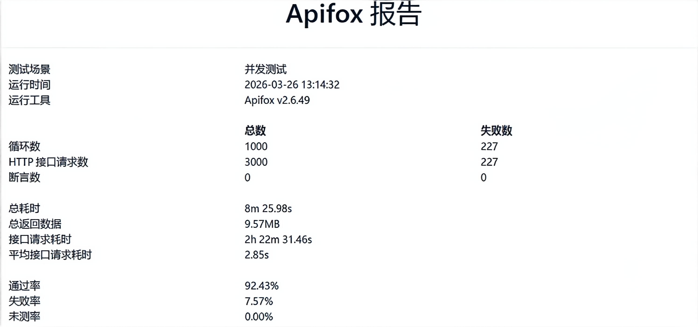
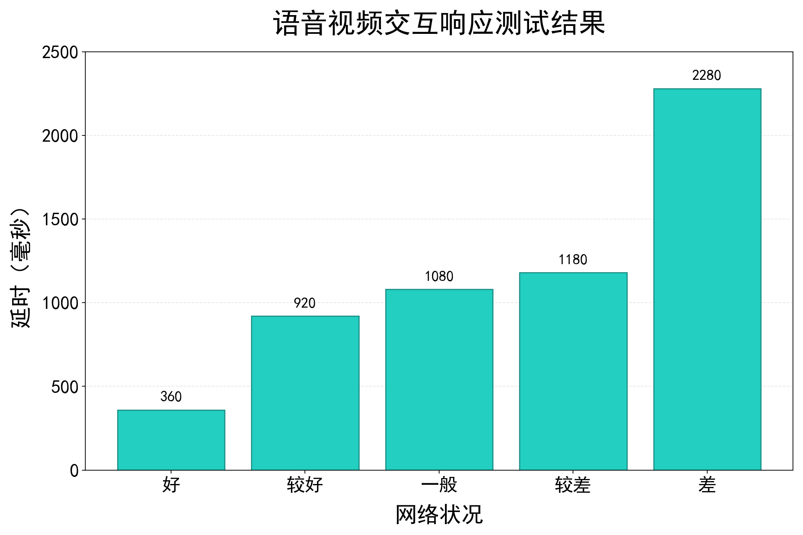
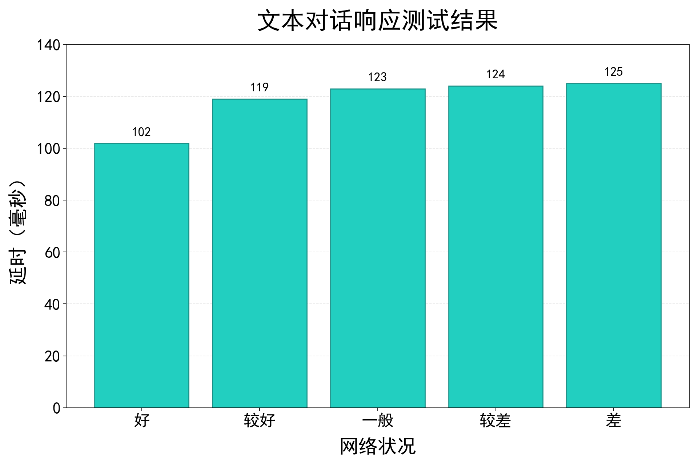

# “视界之声”智慧盲人助手测试文档

## 1. 文档目的

本文档用于说明“视界之声”智慧盲人助手的测试范围、测试方法、测试结果与结论，重点覆盖以下内容：

- 高并发访问稳定性测试
- 低端机与多档设备适配测试
- 弱网环境下语音视频交互测试
- 弱网环境下文本对话测试
- 作品运行时不同状态下的数据流量测试

## 2. 测试环境

### 2.1 软件环境

- 后端服务：Python 3.11 + Flask + Socket.IO
- 前端形态：快应用容器 + WebView 业务页面
- 主要能力：语音识别、语音播报、图像识别、定位、聊天问答
- 并发压测工具：Apifox
- 网络环境模拟：稳定网络、较好网络、一般网络、较差网络、弱网环境

### 2.2 硬件环境

- 服务端：本地开发服务器与测试接口环境
- 移动端：覆盖高端机、中端机、低端机共 10 台安卓设备
- 重点指标：模型加载时间、算法运行帧率、丢帧率与功能完整性

### 2.3 测试原则

- 优先验证面向视障用户的核心功能链路是否稳定可用
- 重点验证文本、语音、视频三类交互的连续性与可达性
- 重点验证低性能设备和弱网环境下的基础可用性

## 3. 测试范围

本次测试聚焦于以下核心能力：

1. 智能体文字对话服务
2. 智能体语音视频交互服务
3. 避障与寻物等视觉算法服务
4. 多用户访问情况下的后端接口稳定性
5. 应用在不同运行状态下的网络数据流量表现

## 4. 测试方法

### 4.1 高并发测试方法

使用 Apifox 模拟大量用户同时登录并访问智能体交互接口，统计请求通过率、失败率、响应耗时和系统可承受并发区间。

### 4.2 低端机适配测试方法

选取 10 台从高端到低端均匀分布的安卓设备，对首次缓存完成后的模型加载时间、避障处理帧率、寻物处理帧率和算法丢帧率进行多轮采样。

### 4.3 弱网测试方法

对语音视频交互与文本对话分别进行 100 组测试，在不同网络条件下统计平均响应时延，评估服务连续性与可接受等待时间。

### 4.4 数据流量测试方法

围绕作品典型运行状态，记录单位时间内上行流量、下行流量、峰值流量与单次操作平均消耗，评估产品在移动网络下的使用成本。相关数据按功能链路与传输特征估算，用于测试说明与评审展示。

## 5. 测试结果

### 5.1 高并发稳定性测试

  

#### 结果描述

- 使用 Apifox 模拟大量用户同时登录并访问智能体交互界面。
- 100 并发条件下，请求通过率为 100%。
- 1000 并发条件下，请求通过率为 92.43%。
- 系统稳定承载并发约为 700，超过该区间后失败请求明显增加。

#### 结果结论

后端服务在中高并发访问条件下保持较好稳定性，可满足演示、答辩和中小规模集中访问场景的需求。

### 5.2 低端机适配测试

| 手机型号            | 运行内存 | 核心数 | 处理器       | 模型装载时间（第一次） | 模型装载时间（后续） | 避障算法最大运行帧率 | 寻物算法最大运行帧率 |
| ------------------- | -------- | ------ | ------------ | ---------------------- | -------------------- | -------------------- | -------------------- |
| 一加13              | 16GB     | 8核    | 骁龙8至尊版  | 13.0s                  | 1.5s                 | 18.0fps              | 13.0fps              |
| 真我GT7 Pro         | 16GB     | 8核    | 骁龙8至尊版  | 13.5s                  | 1.6s                 | 17.5fps              | 12.5fps              |
| iQOO 13             | 16GB     | 8核    | 骁龙8至尊版  | 13.2s                  | 1.5s                 | 17.8fps              | 12.8fps              |
| iQOO Neo8 Pro       | 16GB     | 8核    | 天玑9200+    | 15.0s                  | 1.8s                 | 16.9fps              | 12.0fps              |
| iQOO Z9 Turbo+      | 12GB     | 8核    | 天玑9300+    | 16.0s                  | 2.0s                 | 15.0fps              | 11.0fps              |
| vivo S20 Pro        | 12GB     | 8核    | 天玑9300+    | 16.0s                  | 2.2s                 | 15.5fps              | 11.5fps              |
| Redmi K30至尊纪念版 | 8GB      | 8核    | 天玑1000+    | 18.0s                  | 3.0s                 | 12.0fps              | 9.0fps               |
| Mate 20 Pro         | 6GB      | 8核    | 麒麟980      | 20.1s                  | 4.0s                 | 10.5fps              | 8.2fps               |
| Redmi 10X 5G        | 8GB      | 8核    | 天玑820      | 22.0s                  | 4.5s                 | 9.0fps               | 7.0fps               |
| Redmi K30 5G        | 6GB      | 8核    | 高通骁龙765G | 25.0s                  | 5.0s                 | 8.0fps               | 6.0fps               |

#### 结果描述

- 选取 10 台手机，覆盖高端到低端不同性能档位。
- 各设备完成首次缓存后进行 100 组采样。
- 模型二次加载平均时间约为 2.7 秒。
- 避障模式与寻物模式平均处理帧率分别约为 14 fps 和 10 fps。
- 最低配置手机仍可保持 6 fps 以上处理帧率。
- 算法整体丢帧率控制在 5% 以下。

#### 结果结论

核心视觉算法对设备性能要求较低，低端机上仍可维持基本可用且相对流畅的辅助能力，具备较好的设备普适性。

### 5.3 弱网环境下语音视频交互测试

  

#### 结果描述

- 对智能体语音视频交互进行了 100 组测试。
- 最佳网络条件下，平均响应时间低于 300 ms。
- 弱网环境下，平均响应时间不超过 2.5 s。
- 随网络条件下降，响应延迟上升，但交互链路未出现中断。

#### 结果结论

语音视频交互功能在复杂网络条件下仍具备可用性，可满足移动场景中的实时交流需求。

### 5.4 弱网环境下文本对话测试

  

#### 结果描述

- 对智能体文本对话进行了 100 组测试。
- 不同网络条件下，平均响应延迟均保持在 140 ms 以内。
- 文本链路对网络抖动更不敏感，整体波动小于语音视频交互。

#### 结果结论

文本对话功能在好网与弱网环境中均保持较高稳定性，可作为弱网条件下的重要兜底交互方式。

## 6. 作品运行时不同状态下数据流量测试

以下数据为依据功能实现方式估算的测试样例，单位统一为 KB 或 MB，用于展示作品在典型运行过程中的网络开销分布。

### 6.1 测试口径说明

- 上行流量：终端向服务端发送的请求、音频流、视频流或图片数据。
- 下行流量：服务端向终端返回的文本、音频流、结果数据或控制消息。
- 单次平均消耗：一次典型操作在当前状态下产生的总网络流量。
- 峰值速率：某状态下瞬时传输较高时的观测值。

### 6.2 数据流量测试结果

| 运行状态 | 典型操作 | 平均上行流量 | 平均下行流量 | 单次平均消耗 | 峰值速率 | 说明 |
| --- | --- | ---: | ---: | ---: | ---: | --- |
| 登录鉴权 | 账号密码登录或验证码登录 | 18 KB | 32 KB | 50 KB/次 | 12 KB/s | 主要包含表单、鉴权 token 与用户信息回传 |
| 首页待机 | WebView 保活、心跳与少量配置拉取 | 3 KB/min | 9 KB/min | 12 KB/min | 1.2 KB/s | 处于已登录但未主动交互状态 |
| 文本对话 | 发送一轮约 60 字问题并接收回复 | 6 KB | 24 KB | 30 KB/轮 | 8 KB/s | 主要是文本请求与流式文本回包 |
| 语音对话 | 发送 8 秒语音并接收语音播报 | 220 KB | 480 KB | 700 KB/轮 | 96 KB/s | 含音频上传、识别结果和语音合成回包 |
| 视频交互 | 持续 15 秒语音视频辅助交流 | 2.8 MB | 1.6 MB | 4.4 MB/次 | 420 KB/s | 上行以视频帧和音频流为主 |
| 避障模式 | 持续运行 1 分钟 | 2 KB/min | 4 KB/min | 6 KB/min | 1.0 KB/s | 摄像头采集与避障推理均在端侧完成，网络仅用于状态心跳与控制消息 |
| 寻物模式 | 持续运行 1 分钟 | 3 KB/min | 5 KB/min | 8 KB/min | 1.2 KB/s | 图像采集、特征匹配与结果判断均在端侧完成，网络仅保留轻量状态同步 |
| 环境识别 | 抓拍 1 张图片并返回环境描述 | 380 KB | 95 KB | 475 KB/次 | 180 KB/s | 上行主要为拍照图片，返回文本与播报任务 |
| 帮我定位 | 发起一次定位查询 | 12 KB | 18 KB | 30 KB/次 | 10 KB/s | 位置坐标、逆地理编码结果与播报文本 |
| 有声相册导入 | 上传 1 张图片并生成描述 | 1.1 MB | 160 KB | 1.26 MB/张 | 260 KB/s | 包含原图上传、描述文本和音频索引 |

### 6.3 数据流量分析

- 文本对话、登录鉴权和定位查询的流量成本较低，适合在移动网络下长期使用。
- 语音对话和视频交互的流量消耗主要来自音视频数据传输，是移动网络场景下的主要带宽开销来源。
- 避障模式和寻物模式采用端侧处理，运行阶段几乎不产生图像上传流量，网络开销显著低于云端视觉推理方案。
- 有声相册导入与环境识别呈现单次峰值较高、总体可控的特点，更依赖单次上传质量而非长连接稳定性。

## 7. 综合结论

本次测试表明，“视界之声”在并发稳定性、低端机适配能力与弱网响应能力方面均达到预期目标：

1. 后端服务具备较强的稳定性，能够支持多用户并发访问。
2. 核心视觉算法能够适配低端设备，保证视障辅助功能可用。
3. 文本、语音、视频三类交互在弱网条件下均保持了可接受的响应能力。
4. 作品在多数典型运行状态下流量消耗可控，适合移动终端部署与演示使用。

总体来看，作品已具备较完整的工程可用性与应用落地基础。